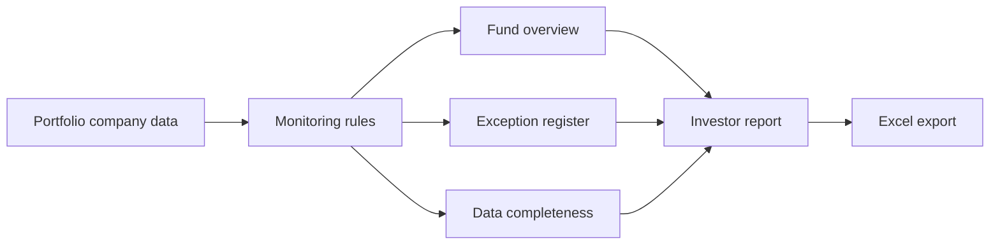

# Private Equity Portfolio Monitoring

A private-equity portfolio monitoring and investor reporting dashboard built with Streamlit.
It demonstrates how a fund operations team can consolidate company data, surface
exceptions, and prepare a quarterly investor snapshot from one reporting workflow.

This project reframes a public-market portfolio tracker around the work of a fund asset
strategy and operations team: maintaining portfolio data, identifying operating and
reporting exceptions, analyzing fund exposure, and preparing quarterly investor reports.

> All companies, fund names, and figures are fictional and for demonstration purposes only.

## Dashboard Preview

The dashboard uses an institutional command-center layout with fund, sector, and geography
filters across every workflow.



## What It Does

- **Portfolio Command Center**: Executive view of value, operating performance, exceptions,
  and reporting readiness across FASO, FASA, FAPEP, and FAGT.
- **Fund Overview**: Fund filters, sector/geography exposure, top companies by valuation,
  and fund-level operating metrics.
- **Portfolio Companies**: Searchable and exportable company database.
- **Performance Monitoring**: Exception register covering revenue decline, EBITDA margin
  compression, high leverage, valuation multiple contraction, and stale reporting.
- **Data Completeness**: Missing-data and quarterly-reporting readiness tracker.
- **Investor Report**: Quarterly snapshot with exposure, top performers, watchlist assets,
  completeness score, and a formatted Excel export.

## Monitoring Rules

| Exception | Trigger |
|---|---|
| Missing quarterly financials | Any required operating field is blank |
| Revenue decline | Revenue growth below -10% |
| EBITDA margin compression | Margin change below -3 percentage points |
| High leverage | Net debt / EBITDA above 5.0x |
| Valuation multiple contraction | Multiple change below -1.0x |
| Stale data | Last update more than 90 days before quarter end |

## Project Structure

```text
portfolio-dashboard/
├── app.py
├── data/
│   ├── portfolio_companies.csv
│   ├── quarterly_financials.csv
│   └── fund_metadata.csv
├── pages/
│   ├── 1_Fund_Overview.py
│   ├── 2_Portfolio_Companies.py
│   ├── 3_Performance_Monitoring.py
│   ├── 4_Data_Completeness.py
│   └── 5_Investor_Report.py
├── src/
│   ├── data_loader.py
│   ├── metrics.py
│   ├── report_export.py
│   └── ui.py
└── requirements.txt
```

## Run Locally

```bash
git clone https://github.com/mriduldaga/private-equity-portfolio-monitoring.git
cd private-equity-portfolio-monitoring
pip install -r requirements.txt
streamlit run app.py
```

The monitoring thresholds and quarter-end date are centralized in
`src/metrics.py`. Replace the fictional CSV files in `data/` with an approved data source
to use the same workflow with another portfolio.

## Validate

```bash
pip install pytest
python -m pytest
python -m compileall -q app.py pages src
```

GitHub Actions runs the same checks on every push and pull request.

## License

This project is available under the [MIT License](LICENSE).
